# Development Guide

Typical day-to-day development is fairly routine. Below is an example of how I would go through an entire process.

### 1. Pull master

```
git checkout master && git pull && git log --oneline -5
```

I always start by pulling the master branch. Doing this first will ensure that I am up-to-date with my team's work. Notice that I use the `&&` symbol to chain together three commands which run in sequential order.

1. `git checkout master` switches me to the master branch.
2. `git pull` updates the master branch with the master branch on Github. As a side note, the master branch on Github is called `origin/master`.
3. `git log --oneline -5` shows the commit history of the branch in a nice succinct format. The `-5` limits the history to the last five commits.

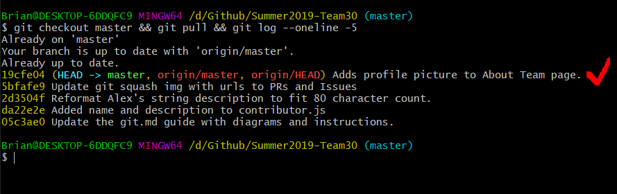

### 2. Rebase your branch

If you are starting a new feature and don't have a branch then follow the [Git Guide](git.md) to create one. If you already have a branch then you will need to do something called rebasing. Rebasing puts any changes you have on top of master. It is kinda like the game Jenga where blocks from the bottom are placed on the top.

First we should change branches. You'll notice that there is a `*` next to the master branch. This indicates that I am currently on the master branch.

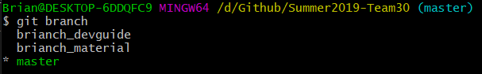

Use `git checkout branchName` to change branches. For example:

```
git checkout brianch_devguide
```

Notice that the terminal now annotates my path with `(brianch_devguide)`.

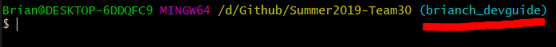

Now let's run `git status` just to make sure we don't have any lingering changes from our previous work session.

```
git status
```

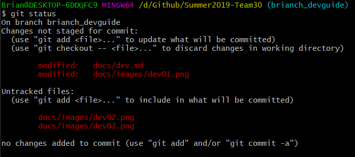

I looks like we do have some changes. Changes are red if they have not been committed. Since we plan on rebasing our changes (remember we want to Jenga our changes to the top of the commit tree), we will need to first make a commit.

```
git add .
git commit -m "fix this message later"
git log --oneline -5
```

The last command will output:

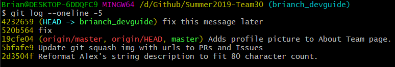

Now that we have a commit we want to rebase.

```
git rebase master
```

Usually there won't be an error however if there is an error, it could look something like this (ingore the part where it says `git rebase brianch_material`. I rebased on top of that branch just to show an example of conflict)

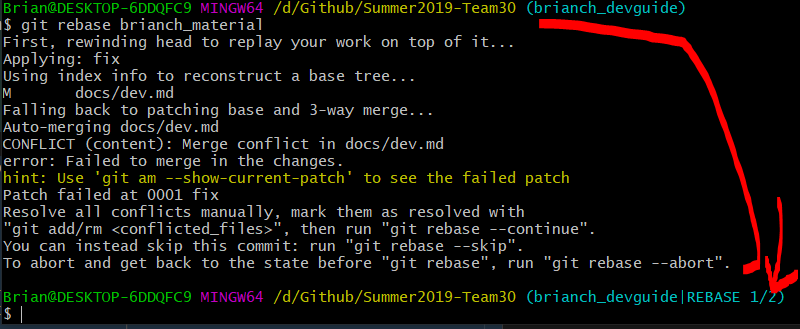

Note that we aren't on the real `brianch_devguide` so if we try to push from here, we will get an error. If we run `git status` we'll find that the conflict occurs in `dev.md` so let's open that file up in Visual Studio Code.

```
git status
```

Now let's open the conflicting file `dev.md`.

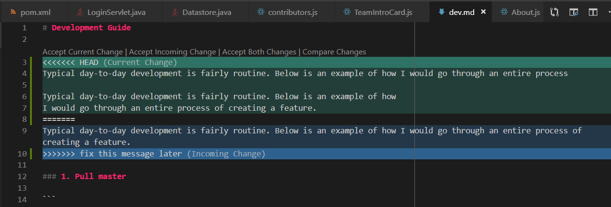

Visual Studio Code is nice in that it has color coding and annotations that depect your changes versus the incoming changes. You want to remove the `<<<` and `===` and `>>>` and all elements of the file that don't look right until you get a cohesive file. Below is an example of what I think think the merge should look like.

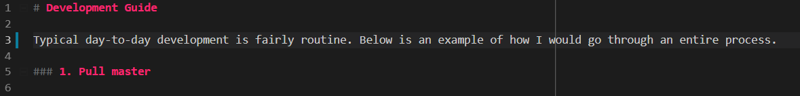

Great, I've removed the lines containing `<<<`, `===` and `>>>` and have kept only the line that I believe to be the correct representation of `dev.md`. You can pull lines from both Current Change and Incoming Change. Now that I'm done fixing things up in the file, I go back to the command line and add the file to the rebase.

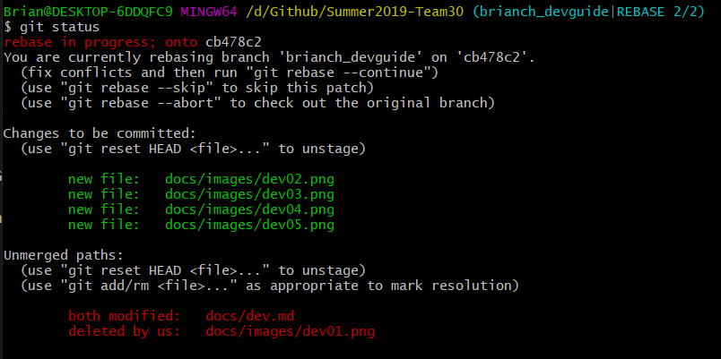

```
git add . && git rebase --continue
```

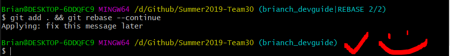

Now you have to force push to your branch for the changes to work. This is because rebasing is similar to rewriting history and rewriting history is dangerous so Github needs you to be absolutely sure that you want to rewrite history by using `-f`.

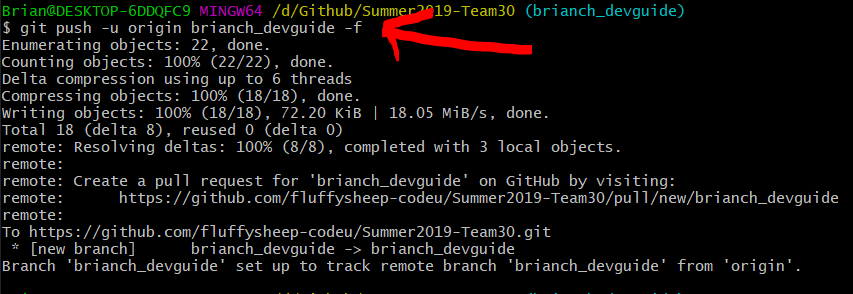

Now we have successfully rebased our branch against master. Basically we took the master Jenga tower, took our change block, and put it on top of the tower.

### 3. Now we can begin working!

What an adventure, now we can begin actually working on our code. Make changes to the codebase at this time.

### 4. Ready to Submit Code for Review?

Now we can go over to the [Git Guide](git.md) to squash your commits and get them prepped for code review.

One last thing, the `git commit --amend --no-edit` command can be extremely helpful if you want to make a change but don't want to change the commit message. It will put your changes onto the last commit. So if you do `git log --oneline -5`, the top most commit will be editted. Note that you will need to force push with `git push -f` to get this on Github.

```
git add .
git commit --amend --no-edit
git push -f
```

You can also use `git commit --amend` to change the commit message of the top most commit.

```
git commit --amend
git push -f
```
