# Git Guide

Read [Using Git](https://sites.google.com/corp/codeustudents.com/summer-2019/reference-guides/using-git?authuser=0) from the CodeU website to help get a better understanding of using Git. There is also a video on the website that goes through the process of making a branch and pushing changes.

Note that we have our own methodology to using git to keep our commit history clean. Read more below!

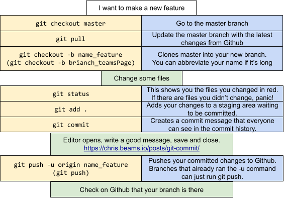

## Making a New Branch and Changes

```
# First go to the master branch.
git checkout master

# And update it
git pull

# Then make a new branch. This command clones the branch you are currently on
# to your new branch.
git checkout -b brianch_GitGuide

# Use this command to make sure you are on the right branch.
git branch

```

Now you can make changes!

## Pushing Your Changes for Review

```
# Check what files you've modified on your branch.
git status

# Make sure the files you have edited are red.
# If there are other files that are red, then uh...panic?

git add .
git commit

# Opens an editor. Read https://chris.beams.io/posts/git-commit/ on what makes
# a good commit message. Save and close.

git checkout master

git pull

# Don't forget to change yourBranchName to your actual branch name.
git checkout yourBranchName

git rebase master

# You might have conflicts here. If you do read below.
git push

```

## Making Pull Requests

1. Go to pull request tab on our [Github](https://github.com/fluffysheep-codeu/Summer2019-Team30/pulls) and click "New Pull Request".
   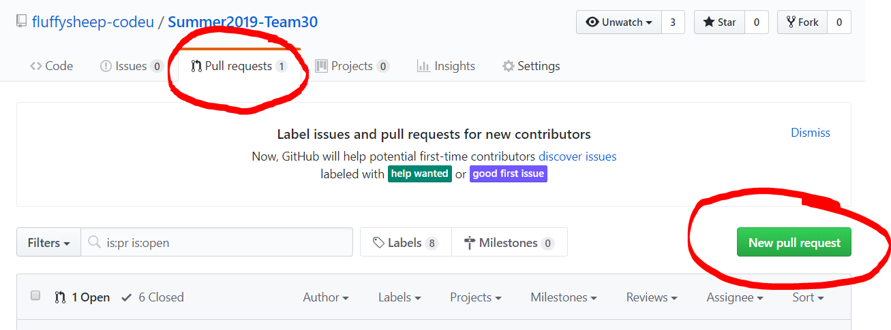

2. Make sure that the base branch is set to `master` and the compare branch is set your `branch name`. Notice that there are 3 commits in this pull request. For our repository, we want 1 commit per pull request. The follow steps will show you how to squash your commits. Click "Create pull request".
   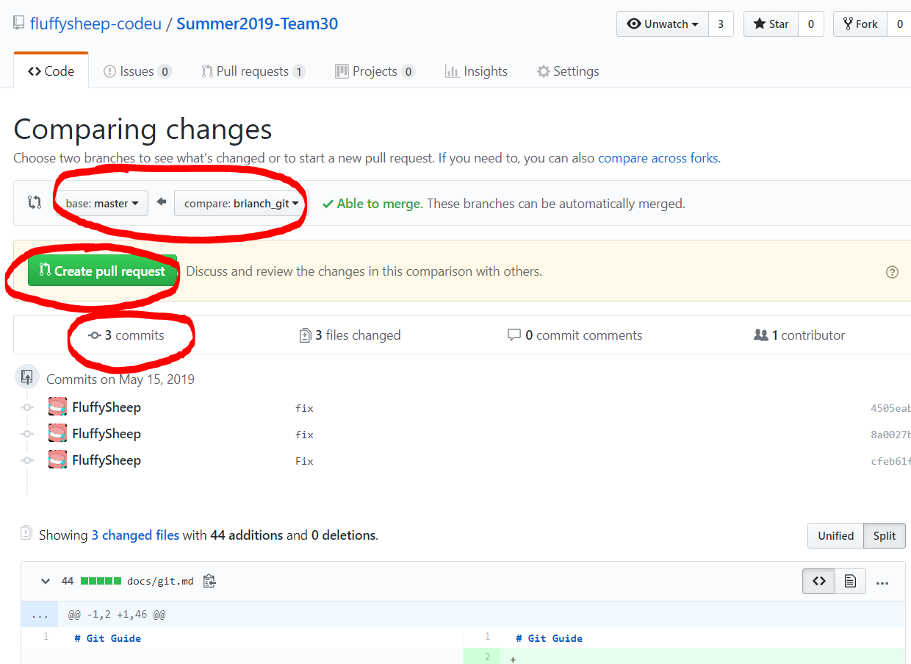

3. Update the title and description. Make sure the title is meaningful. Usually you want a screenshot in the description. Not all features require a screenshot so use your best judgement. Then click "Creat pull request".
   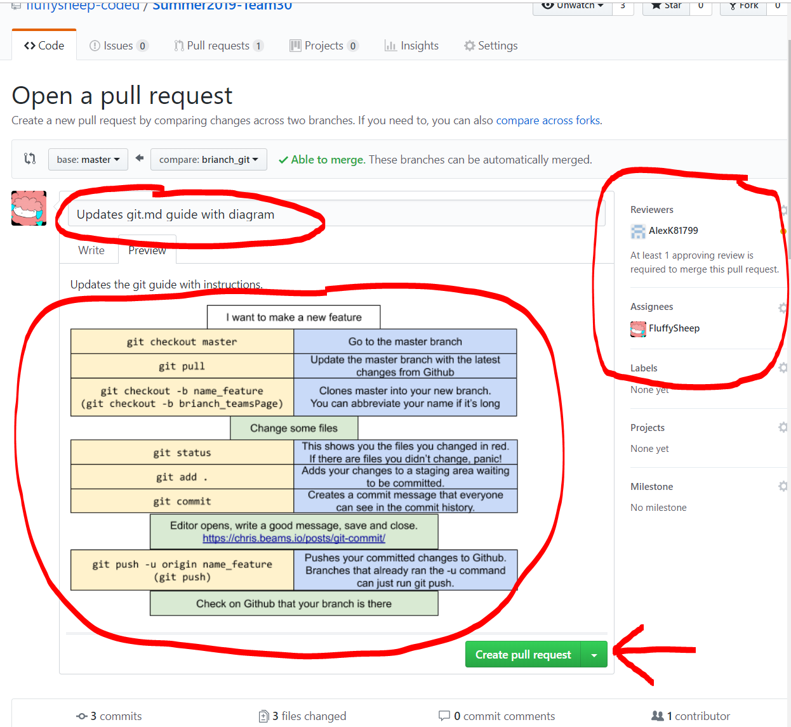

4. If you navigate to the commit tab, you will notice that the three commits displayed. You will also notice that I didn't write very good commit messages so we'll want to fix that.
   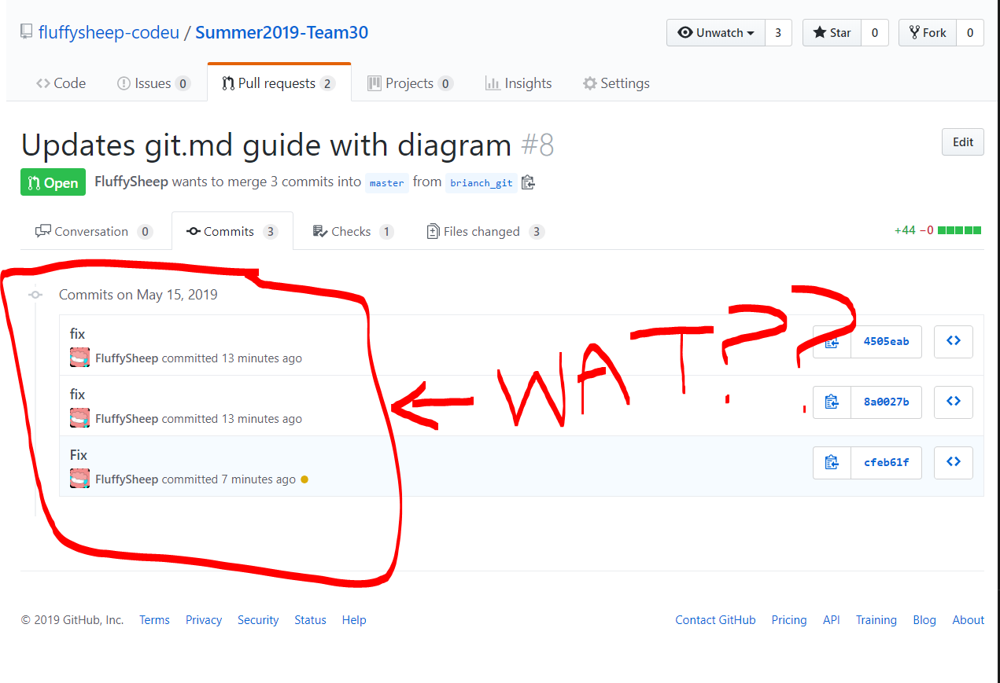

## Rewriting History

1. Notice that you can also see these exact same commits in your terminal using `git log --oneline -5`.
   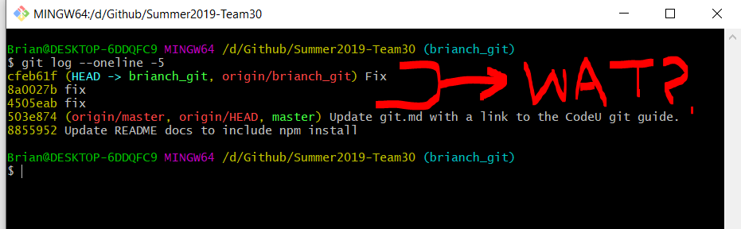

2. Ok now let's prepare to rewrite our history. First we need to update our master branch.

   ```
   git checkout master
   git pull

   # Don't forget to change yourBranchName to your actual branch name.
   git checkout yourBranchName
   ```

3. Now use `git rebase -i master`. This tells git to rewrite history up to where the master branch is. You can see in the screenshot that `master` points to commit number `503e874`. So we are rewriting everything after that commit.
   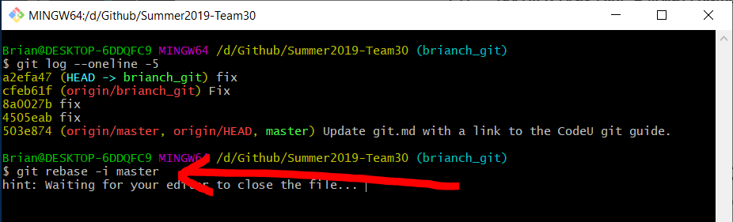

4. When you run `git rebase -i master` it will put you into an editor. I have my editor configured to use sublime, but you can also configure your editor to be whatever you want. You can even make git open up the Visual Studio Code editor we use for this project. [See instructions here](https://code.visualstudio.com/docs/editor/versioncontrol#_vs-code-as-git-editor). Observe that I have changed the left hand column to use "r" and "s". An "r" means I want to reword the commit. An "s" means I want to squash the commit. Commits squash upwards meaning all the "s" commits will be smooshed into the "r" commit. At the end of this, only commit # `4505eab` will exist. If you save (sometimes you have to close the editor window) the next step will pop up.
   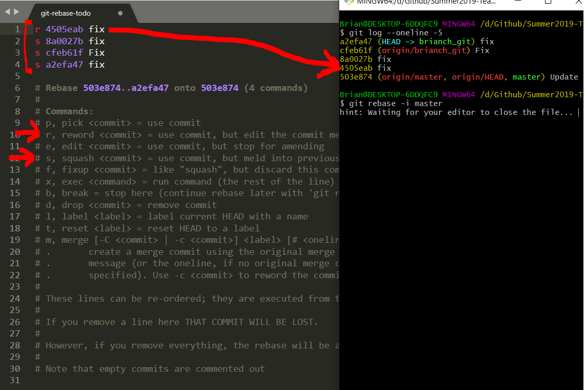

5. Now a `COMMIT_EDITMSG` file will open. This message will have the commit youu want to reword. You can see in the screenshot below that the "Last command done" was a reword on `4505eab`. Now we just want to update the commit message to look beautiful. Read [Chris Beam's Post](https://chris.beams.io/posts/git-commit/) on what a good commit message looks like. An Issue corresponds to a Github Issue which we will be using later down the line during our open project to track our team's progress. `PR` stands for "Pull Request". You can find the pull request number near the title on the pull request page. A URL is optional but can be handy if you have something important to show.
   

6. After you save (and maybe need to close). A new `COMMIT_EDITMSG` should appear. This file represeents all the commits that will be squashed into one commit. Make sure to DELETE all the other lines that are not relevant to your commit. You should delete all the "fix" messages below. In fact you can delete everything under your commit message, in this case everything under the URL line should be deleted.
   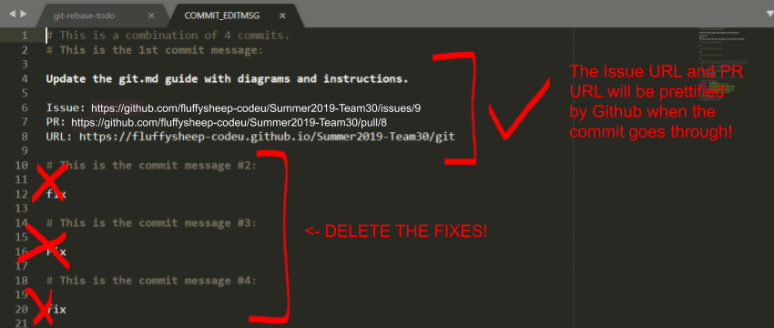

7. Now, if you check `git log --oneline -5` you will notice that all the "Fix" commits are gone AND you only have 1 commit ahead of master which is exactly what we want.
   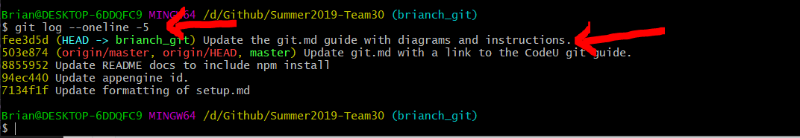

8. We are ready to push! But we can't just run `git push`. If you rewrite your history, git will be angry so you will need to force push using `git push -f`. The `-f` forces `git push` to work and tells git to ignore all the errors and warnings.
   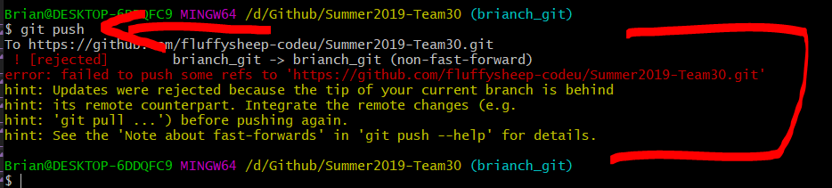
   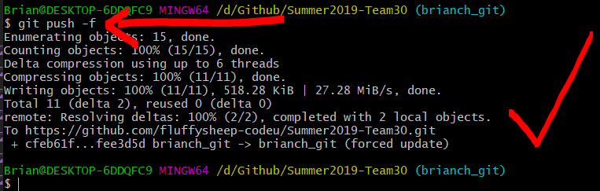

## Getting Your Pull Request Reviewed

1. Hurray we have now successfully rewrote history. Now we should go back to Github and finish up the pull request. Notice that your commit tab now has only 1 commit and it looks clean and professional.
   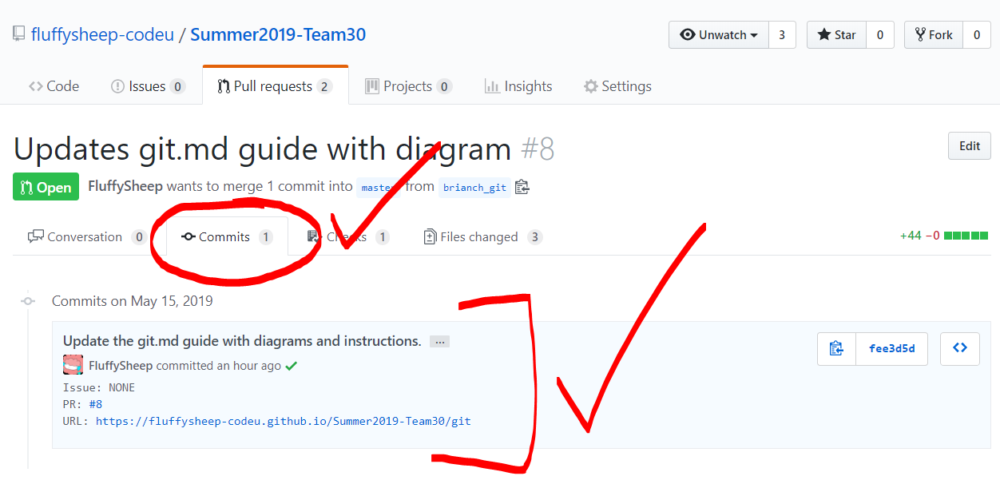

2. In the "Conversation" tab, you will need to add a Reviewer. You can add FluffySheep (Brian) or another team member. You are required to get a reviewer to review your code otherwise you will be blocked from merging your code. If you need to make changes to the PR description, there is an edit button. For exampled, if you forgot to add a screenshot and your reviewer asks for it, you can upload it through this edit button.
   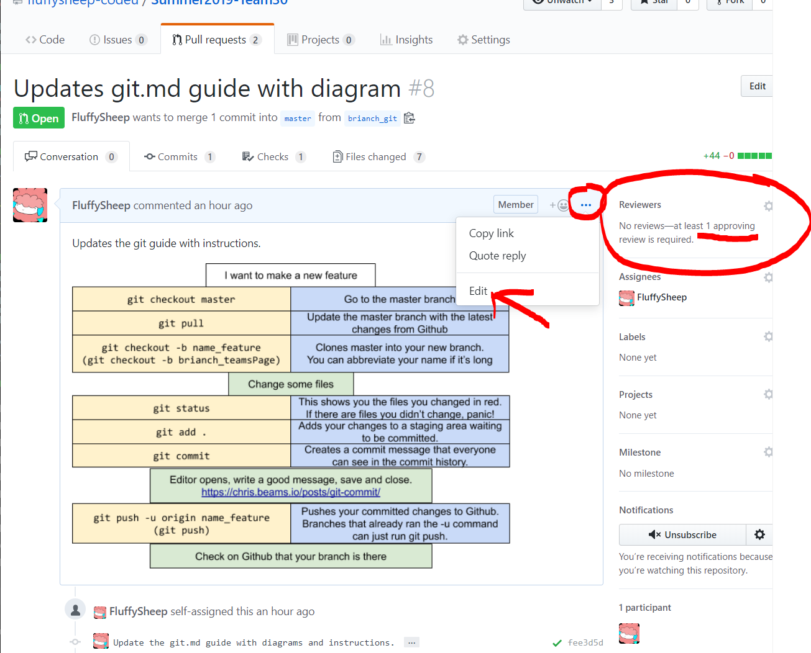

3. Finally you will need our stickler linter to pass. This is just a program that runs somewhere in the cloud that checks the style of our code. If we don't comply with the style guide, it blocks our submission by telling us what is wrong. You will also need approval from one team member before merging. This entire merging section at the bottom should turn green before you can click the "Rebase and merge" button. Once it is all green, you are responsible for clicking the "Rebase and merge" button. Not your reviewer!
   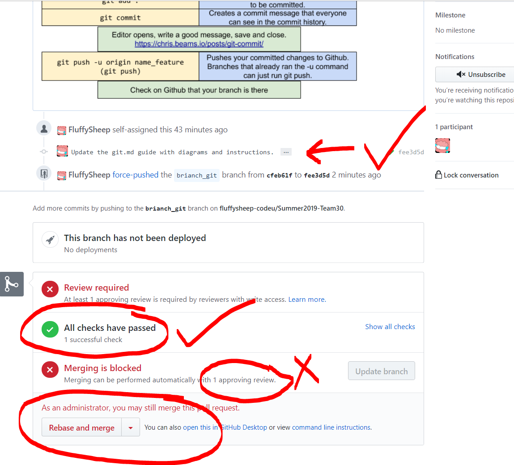
