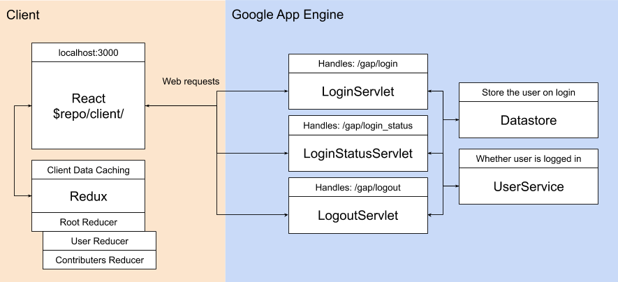

# Project Overview

Here is a high level overview of what the project design looks like.



## Client

The client is built on the [React framework](https://reactjs.org/). React is a javascript library that helps build UI. While React has many advantages, we integrated React to solve these specific problems:

1. Hot reloading. Changes to javascript files are instantly viewable and interactable when the file is saved. If we use vanilla javascript + maven, we will need to invoke `maven appengine:devserver` from our terminal on every change.

2. Reusuable UI components. React is built around reusing UI components which means we don't need to run our own componentization system.

The [Redux](https://redux.js.org/) library is used to help keep state on the client. Think of Redux like a local cache. For example if we want the Sign In to change to a Sign Out button when the user has logged in, we might cache an `isLoggedIn` boolean in Redux. This boolean can then be accessed by all React components without needing to query the server for whether the user is logged in. Reducers are used to specify what state needs to be stored and are eventually combined into the Root reducer.

## Server

When the client makes web requests to the server, a servlet will pick up the request. A servlet knows what requests to intercept by an annotation we provide it.

For example, the login servlet below intercepts the url `localhost:8080/api/login`, where `localhost:8080` will be replaced by the actual live website url when deployed through app engine.

```
@WebServlet("/api/login")
public class LoginServlet extends HttpServlet {
  @Override
  public void doGet(HttpServletRequest request, HttpServletResponse response) throws IOException {}

  @Override
  public void doPost(HttpServletRequest request, HttpServletResponse response) throws IOException {}
}
```

## Local Development

You might have noticed that the client runs on `localhost:3000` but the server runs on `localhost:8080`. During actual deployment, Maven will copy the client build from `client/build` into the `$root/target` output folder. Then Maven will bundle the client with the server upon deployment so that both the client and server work together on the same port.

For development, we run the client and server on different ports to allow for more flexible development. Since the client and server run on different ports, we can restart each individually without interrupting the other. This means changes on the client will not require a server shutdown and vis versa.

The client requests on `localhost:3000` are proxied over to `localhost:8080` via proxies built into the [Create React App](https://github.com/facebook/create-react-app) setup, which is what this project uses. There are two parts to this proxy. A proxy element is added to the `package.json` file under the `client/` folder. Another proxy is added in `setupProxy.js` in the `client/src/` directory. You can read more about proxying in React at [here](https://bit.ly/2JfbgHX).
